# Service Dependency Graph

Directed graph of service-to-service dependencies, reflecting the post-§15 Part 1 migration state (assumes Wave 3 of the 2026-04-23 cleanup plan is complete — see `docs/architecture/tech-debt-2026-04-23.md`).

## How to read

- Solid black arrow (`-->`) = ctor-injected dependency, eagerly resolved.
- Dashed orange arrow labelled `(lazy)` = resolved on-demand via `IServiceProvider.GetRequiredService<T>()`. This pattern breaks DI cycles where two services legitimately call each other. The edges are colored via Mermaid `linkStyle` so the cycle-breaking sites stand out — a healthy graph minimizes them.
- Cross-cutting services (AuditLog, Email, Notification, RoleAssignment, HumansMetrics) are shown separately to reduce noise.
- Intra-section edges are omitted when they don't cross a section boundary.
- Read-split interfaces: edges into a section that read through its `I<Section>ServiceRead` boundary (e.g. `IUserServiceRead`, `ITeamServiceRead`, `ICampServiceRead`, `ITicketServiceRead`, `IConsentServiceRead`) are collapsed onto the owning service node. The label on the node still names the full service; the read interface is the cross-section consumption surface.

## Mermaid diagram

```mermaid
graph LR
    %% ── Section colors ──
    classDef profiles fill:#4a9eff,color:#fff
    classDef teams fill:#22c55e,color:#fff
    classDef camps fill:#f59e0b,color:#fff
    classDef cityplanning fill:#f97316,color:#fff
    classDef shifts fill:#8b5cf6,color:#fff
    classDef governance fill:#ec4899,color:#fff
    classDef legal fill:#6366f1,color:#fff
    classDef tickets fill:#14b8a6,color:#fff
    classDef campaigns fill:#ef4444,color:#fff
    classDef google fill:#0ea5e9,color:#fff
    classDef onboarding fill:#a3e635,color:#000
    classDef feedback fill:#d946ef,color:#fff
    classDef auth fill:#facc15,color:#000
    classDef users fill:#94a3b8,color:#000
    classDef budget fill:#64748b,color:#fff
    classDef calendar fill:#06b6d4,color:#fff
    classDef dashboard fill:#f43f5e,color:#fff
    classDef notifications fill:#a855f7,color:#fff
    classDef gdpr fill:#0f172a,color:#fff
    classDef mailer fill:#10b981,color:#fff
    classDef search fill:#fb7185,color:#fff
    classDef issues fill:#fbbf24,color:#000
    classDef store fill:#7c3aed,color:#fff
    classDef expenses fill:#9ca3af,color:#000
    classDef containers fill:#4ade80,color:#000
    classDef events fill:#2dd4bf,color:#000
    classDef agent fill:#e879f9,color:#000
    classDef crosscut fill:#334155,color:#fff

    %% ── Cross-cutting services (hub) ──
    Audit[AuditLogService]:::crosscut
    AuditViewer[AuditViewerService]:::crosscut
    Email[IEmailService]:::crosscut
    Notif[NotificationService]:::crosscut
    Role[RoleAssignmentService]:::auth
    Metrics[HumansMetricsService]:::crosscut

    %% ── Section services ──
    Prof[ProfileService]:::profiles
    CF[ContactFieldService]:::profiles
    UEmail[UserEmailService]:::profiles
    CommPref[CommunicationPreferenceService]:::profiles
    Merge[AccountMergeService]:::profiles
    DupAcct[DuplicateAccountService]:::profiles
    EmailProb[EmailProblemsService]:::profiles

    Team[TeamService]:::teams
    TPage[TeamPageService]:::teams
    TRes[TeamResourceService]:::teams

    Camp[CampService]:::camps
    CampContact[CampContactService]:::camps
    CampRole[CampRoleService]:::camps

    CityPlan[CityPlanningService]:::cityplanning

    ShiftMgmt[ShiftManagementService]:::shifts
    ShiftSign[ShiftSignupService]:::shifts
    VolTrack[VolunteerTrackingService]:::shifts
    BurnSettings[BurnSettingsService]:::shifts
    ShiftView[ShiftViewService]:::shifts

    AppDec[ApplicationDecisionService]:::governance
    MembershipCalc[MembershipCalculator]:::governance
    MemQuery[MembershipQuery]:::governance
    GovIndex[GovernanceIndexService]:::governance

    LegalDoc[LegalDocumentService]:::legal
    AdminLegal[AdminLegalDocumentService]:::legal
    LegalSync[LegalDocumentSyncService]:::legal
    Consent[ConsentService]:::legal

    TicketQ[TicketQueryService]:::tickets
    TicketSync[TicketSyncService]:::tickets
    TicketBudget[TicketingBudgetService]:::tickets
    TicketTransfer[TicketTransferService]:::tickets
    AttendeeImport[AttendeeContactImportService]:::tickets
    OnsiteRoster[OnsiteRosterService]:::tickets

    Campaign[CampaignService]:::campaigns

    GSyncSvc[GoogleWorkspaceSyncService]:::google
    GGroupSync[GoogleGroupSyncService]:::google
    GAdmin[GoogleAdminService]:::google
    GUser[GoogleWorkspaceUserService]:::google
    EmailProv[EmailProvisioningService]:::google
    SyncSet[SyncSettingsService]:::google
    DriveMon[DriveActivityMonitorService]:::google
    GRemoval[GoogleRemovalNotificationService]:::google

    Onboard[OnboardingService]:::onboarding
    HumanLifecycle[HumanLifecycleService]:::onboarding
    Feedback[FeedbackService]:::feedback
    Budget[BudgetService]:::budget

    User[UserService]:::users
    AcctProv[AccountProvisioningService]:::users
    Unsub[UnsubscribeService]:::users
    AcctDel[AccountDeletionService]:::users

    AdminAuth[AdminAuthorizationService]:::auth
    MagicLink[MagicLinkService]:::auth

    Cal[CalendarService]:::calendar

    Dash[DashboardService]:::dashboard
    AdminDash[AdminDashboardService]:::dashboard

    NotifEmitter[NotificationEmitter]:::notifications
    NotifInbox[NotificationInboxService]:::notifications
    NotifResolver[NotificationRecipientResolver]:::notifications
    NotifMeter[NotificationMeterProvider]:::notifications
    OutboxEmail[OutboxEmailService]:::notifications

    Gdpr[GdprExportService]:::gdpr

    Search[SearchService]:::search
    Issues[IssuesService]:::issues
    Store[StoreService]:::store
    ExpenseReport[ExpenseReportService]:::expenses
    Container[ContainerService]:::containers
    MailerSync[MailerAudienceSyncService]:::mailer
    MailerImport[MailerImportService]:::mailer

    EventSvc[EventService]:::events
    Agent[AgentService]:::agent

    %% ═══════════════════════════════════
    %% Ctor-injected dependencies (solid)
    %% ═══════════════════════════════════

    %% Profiles section
    Prof --> User
    Prof --> Audit
    CF --> User
    CF --> Team
    CF --> Role
    UEmail --> User
    UEmail --> Audit
    CommPref --> User
    CommPref --> Audit
    Merge --> User
    Merge --> Role
    Merge --> Notif
    Merge --> Audit
    DupAcct --> User
    DupAcct --> Team
    DupAcct --> Role
    DupAcct --> Audit
    EmailProb --> User
    EmailProb --> UEmail

    %% Teams section
    Team --> ShiftMgmt
    Team --> NotifEmitter
    Team --> Audit
    Team --> AdminAuth
    TPage --> Team
    TPage --> TRes
    TPage --> ShiftMgmt
    TPage --> User
    TRes --> Team
    TRes --> Audit

    %% Camps section
    Camp --> User
    Camp --> NotifEmitter
    Camp --> Audit
    CampContact --> Email
    CampContact --> NotifEmitter
    CampContact --> Audit
    CampRole --> Camp
    CampRole --> User
    CampRole --> UEmail
    CampRole --> NotifEmitter
    CampRole --> Audit

    %% CityPlanning section
    CityPlan --> Camp
    CityPlan --> Team
    CityPlan --> User

    %% Shifts section
    ShiftMgmt --> Audit
    ShiftMgmt --> AdminAuth
    ShiftSign --> ShiftMgmt
    ShiftSign --> MembershipCalc
    ShiftSign --> Notif
    ShiftSign --> Audit
    ShiftSign --> AdminAuth
    VolTrack --> User
    %% BurnSettings + ShiftView are repo-only read adapters (no service→service edges)

    %% Governance section
    AppDec --> User
    AppDec --> Prof
    AppDec --> Role
    AppDec --> UEmail
    AppDec --> Email
    AppDec --> Notif
    AppDec --> Metrics
    AppDec --> Audit
    MembershipCalc --> MemQuery
    MembershipCalc --> User
    MembershipCalc --> LegalSync
    MemQuery --> Team
    MemQuery --> Role
    GovIndex --> AppDec
    GovIndex --> LegalDoc
    GovIndex --> User

    %% Legal section
    AdminLegal --> LegalSync
    AdminLegal --> Team
    LegalSync --> User
    LegalSync --> Team
    LegalSync --> Notif
    Consent --> LegalSync
    Consent --> NotifInbox
    Consent --> User
    Consent --> Metrics

    %% Tickets section
    TicketQ --> Budget
    TicketQ --> Campaign
    TicketQ --> User
    TicketQ --> UEmail
    TicketQ --> Team
    TicketQ --> ShiftMgmt
    TicketSync --> User
    TicketSync --> Campaign
    TicketSync --> ShiftMgmt
    TicketBudget --> Budget
    TicketTransfer --> User
    TicketTransfer --> UEmail
    TicketTransfer --> Email
    TicketTransfer --> Audit
    AttendeeImport --> AcctProv
    AttendeeImport --> User
    AttendeeImport --> UEmail
    AttendeeImport --> ShiftMgmt
    AttendeeImport --> Audit
    OnsiteRoster --> User
    OnsiteRoster --> ShiftMgmt
    OnsiteRoster --> Camp
    OnsiteRoster --> Team
    OnsiteRoster --> Role

    %% Campaigns section
    Campaign --> Team
    Campaign --> User
    Campaign --> UEmail
    Campaign --> CommPref
    Campaign --> Notif
    Campaign --> Email

    %% Google section
    GSyncSvc --> Team
    GSyncSvc --> User
    GSyncSvc --> UEmail
    GSyncSvc --> GGroupSync
    GSyncSvc --> SyncSet
    GSyncSvc --> GRemoval
    GSyncSvc --> Audit
    GGroupSync --> Team
    GGroupSync --> TRes
    GGroupSync --> User
    GGroupSync --> UEmail
    GGroupSync --> SyncSet
    GGroupSync --> GRemoval
    GGroupSync --> Audit
    GAdmin --> GUser
    GAdmin --> GSyncSvc
    GAdmin --> Team
    GAdmin --> TRes
    GAdmin --> User
    GAdmin --> UEmail
    GAdmin --> Audit
    EmailProv --> User
    EmailProv --> GUser
    EmailProv --> UEmail
    EmailProv --> Team
    EmailProv --> Email
    EmailProv --> Notif
    EmailProv --> Audit
    GRemoval --> UEmail
    GRemoval --> User
    GRemoval --> Email
    DriveMon --> TRes

    %% AuditLog read+render side
    %% AuditLogService injects IUserServiceRead for display-name lookups.
    %% AuditViewerService composes resolved audit pages; calls cross-section services
    %% for display-name stitching (lifted out of AuditLogRepository in 2026-05 alignment).
    Audit --> User
    AuditViewer --> Audit
    AuditViewer --> User
    AuditViewer --> Team
    AuditViewer --> TRes
    %% DriveActivityMonitorRepository writes ctx.AuditLogEntries directly — tracked §6 violation,
    %% pending GoogleIntegration /section-align to route through IAuditLogService.LogAsync.
    DriveMon -. "pending: writes ctx.AuditLogEntries directly (see OnlyAuditLogRepositoryWritesAuditLogEntries.baseline.txt)" .-> Audit

    %% Onboarding section
    %% #568: ProfileService no longer injects IOnboardingService — the Profile↔Onboarding
    %% cycle is gone. Onboard → Prof is now a one-way eager edge.
    Onboard --> Prof
    Onboard --> User
    Onboard --> AppDec
    Onboard --> MembershipCalc
    Onboard --> Email
    Onboard --> Notif
    Onboard --> Metrics

    HumanLifecycle --> Prof
    HumanLifecycle --> Notif
    HumanLifecycle --> NotifInbox
    HumanLifecycle --> Metrics

    %% Feedback section
    Feedback --> User
    Feedback --> UEmail
    Feedback --> Team
    Feedback --> Email
    Feedback --> Notif
    Feedback --> Audit

    %% Budget section
    Budget --> Team
    Budget --> User

    %% Users section
    User --> AdminAuth
    AcctProv --> UEmail
    AcctProv --> Prof
    AcctProv --> Audit
    Unsub --> User
    Unsub --> CommPref
    AcctDel --> User
    AcctDel --> UEmail
    AcctDel --> Team
    AcctDel --> Role
    AcctDel --> ShiftMgmt
    AcctDel --> ShiftSign
    AcctDel --> Prof
    AcctDel --> TicketQ
    AcctDel --> Audit
    AcctDel --> Email

    %% Auth section
    Role --> User
    Role --> NotifEmitter
    Role --> Audit
    MagicLink --> UEmail
    MagicLink --> User
    MagicLink --> Email
    %% AdminAuthorizationService reads IRoleAssignmentRepository + ICurrentUserContext only — no service→service edges.

    %% Calendar section
    Cal --> Team
    Cal --> Audit

    %% Dashboard section
    Dash --> MembershipCalc
    Dash --> AppDec
    Dash --> ShiftMgmt
    Dash --> ShiftView
    Dash --> TicketQ
    Dash --> User
    Dash --> Team
    AdminDash --> User
    AdminDash --> MembershipCalc
    AdminDash --> AppDec
    AdminDash --> ShiftMgmt
    AdminDash --> ShiftView

    %% Notifications cluster
    Notif --> NotifEmitter
    Notif --> NotifResolver
    Notif --> CommPref
    NotifEmitter --> CommPref
    NotifInbox --> User
    NotifResolver --> Team
    NotifResolver --> Role
    NotifMeter --> Prof
    NotifMeter --> User
    NotifMeter --> GSyncSvc
    NotifMeter --> Team
    NotifMeter --> TicketSync
    NotifMeter --> AppDec
    NotifMeter --> Camp
    OutboxEmail --> UEmail
    OutboxEmail --> CommPref
    OutboxEmail --> Metrics

    %% Search / Issues / Store / Expenses / Containers / Mailer / Events
    Search --> User
    Search --> Team
    Search --> Camp
    Search --> ShiftMgmt
    Search --> EventSvc
    Issues --> User
    Issues --> UEmail
    Issues --> Role
    Issues --> Email
    Issues --> Notif
    Issues --> Audit
    Store --> Camp
    Store --> ShiftMgmt
    Store --> Audit
    ExpenseReport --> Budget
    ExpenseReport --> Team
    ExpenseReport --> User
    ExpenseReport --> Prof
    ExpenseReport --> Audit
    Container --> Camp
    Container --> Audit
    MailerSync --> UEmail
    MailerSync --> Audit
    MailerImport --> UEmail
    MailerImport --> User
    MailerImport --> AcctProv
    MailerImport --> CommPref
    MailerImport --> Audit
    EventSvc --> BurnSettings
    %% AgentService + AgentAdminStatusService depend only on Agent-internal interfaces
    %% (settings/repo/dispatcher/Anthropic client) — no cross-section service edges.

    %% ═══════════════════════════════════
    %% Lazy-resolved (IServiceProvider) —
    %% break DI cycles
    %% ═══════════════════════════════════

    Team -. "lazy" .-> User
    Team -. "lazy" .-> TRes
    Team -. "lazy" .-> Role
    Team -. "lazy" .-> Email
    TRes -. "lazy" .-> Role
    Camp -. "lazy" .-> CampRole
    Consent -. "lazy" .-> MembershipCalc
    MembershipCalc -. "lazy" .-> Consent
    ShiftMgmt -. "lazy" .-> Team
    ShiftMgmt -. "lazy" .-> Role
    ShiftMgmt -. "lazy" .-> TicketQ
    ShiftMgmt -. "lazy" .-> User
    ShiftSign -. "lazy" .-> Team
    UEmail -. "lazy" .-> Merge
    UEmail -. "lazy" .-> TicketQ
    GSyncSvc -. "lazy" .-> TRes

    %% ── Edge styling ──
    %% Lazy-resolution edges — colored + thickened so the cycle-breaking
    %% dashed arrows pop visually against eager solid arrows. The first lazy
    %% edge in this diagram is the (N+1)-th link after the eager arrows
    %% above; recompute the index range whenever edges are added or removed.
    %% Eager count (including the DriveMon → Audit "pending" dashed arrow that
    %% Mermaid counts as a link): 245 eager-or-pending links, indices 0..244.
    %% The 16 lazy edges are indices 245..260.
    linkStyle 245,246,247,248,249,250,251,252,253,254,255,256,257,258,259,260 stroke:#f97316,stroke-width:2.5px
```

## Cycles broken by lazy-resolution

The `IServiceProvider` + property-getter lazy-resolution pattern is used to break otherwise-intractable DI cycles. Each pair below would fail constructor injection if both sides tried to eager-inject the other. The deletion-cascade extraction (peterdrier/Humans PR #314, nobodies-collective/Humans#582), the ProfileService decomposition (peterdrier/Humans#685), the cross-section read-write split (`I<Section>ServiceRead`), and the OnboardingService cycle fix (#568) together made `UserService`, `ProfileService`, and the Onboarding orchestrator far less entangled — the old User↔* cycles, the Profile↔AccountDeletion cycle, and the Profile↔Onboarding cycle are all gone.

1. **Team ↔ TeamResource** — TeamService lazy-resolves `ITeamResourceService` for team-deletion resource cleanup; TeamResourceService eagerly injects `ITeamService` for ownership checks.
2. **ShiftManagement ↔ Team** — ShiftManagementService lazy-resolves `ITeamService`; TeamService eagerly injects `IShiftManagementService`. (ShiftSignupService also lazy-resolves `ITeamServiceRead`, but the reverse edge runs through ShiftManagementService, not ShiftSignupService directly.)
3. **ShiftManagement ↔ Tickets** — ShiftManagementService lazy-resolves `ITicketServiceRead` (ticket-holder → shift-eligibility lookups); TicketQueryService eagerly injects `IShiftManagementService`.
4. **Consent ↔ MembershipCalculator** — ConsentService lazy-resolves `IMembershipCalculator` for status recomputes; MembershipCalculator lazy-resolves `IConsentServiceRead` for required-docs-given checks. Both sides are lazy because this cycle is two-way hot.
5. **GoogleWorkspaceSync ↔ TeamResource** — GoogleWorkspaceSyncService lazy-resolves `ITeamResourceService` for resource reconciliation during workspace sync; TeamResourceService eagerly injects `IGoogleWorkspaceSyncService` to push resource changes into Google.

Other notable one-way lazy edges (not cycles):

- **Team → User** — TeamService lazy-resolves `IUserService` for user-slice stitching. Used to be a cycle (User↔Team), but PR #314 dropped UserService's eager `ITeamService` injection — User no longer reaches back into Team.
- **UserEmail → Tickets** (`ITicketServiceRead`) — UserEmailService lazy-resolves the tickets read interface for the email delete-guard (nobodies-collective/Humans#758), to detect ticket-linked addresses. TicketQueryService eagerly injects `IUserEmailService`, so this closes a cycle that must stay lazy on the UserEmail side.
- **UserEmail → AccountMerge** — UserEmailService lazy-resolves `IAccountMergeService` for merge-driven email reparenting; AccountMergeService injects `IUserEmailRepository` (not the service) to avoid creating a reverse eager edge.
- **CampService → CampRoleService** — CampService holds `Lazy<ICampRoleService>` (intra-section) to break the Camp↔CampRole construction cycle; CampRoleService eagerly injects `ICampService`.
- **ShiftManagement → Role / User**, **Team → Role / Email**, **TeamResource → Role**, **GoogleWorkspaceSync → TeamResource** are one-way lazy edges where the target service does not call back. Lazy is used because eager injection would still create a cycle through other paths in the graph (notably through `ISystemTeamSync`, the job interface omitted from this service-only graph).

When adding a new cross-service call, default to ctor injection. Reach for the lazy pattern only when ctor injection produces a circular DI error, and document why at the call site.

## Fan-in hotspots (most depended-on services)

Threshold: services with >= 3 incoming edges (eager + lazy combined). Counts are derived from the edge set above; read-interface variants (`I<Section>ServiceRead`) are folded onto the owning service node.

| Service | Eager dependents | Lazy dependents | Notes |
|---------|-----------------:|----------------:|-------|
| `UserService` | 44 | 2 | By far the largest fan-in after the cross-section read-write split — almost every section reads users through `IUserServiceRead`. **No outbound edges** except a single eager `IAdminAuthorizationService` (PR #314 made User otherwise foundational; the old User↔* cycles were resolved by extracting deletion-cascade orchestration into `AccountDeletionService`, and Team→User is now one-way lazy). |
| `AuditLogService` | 32 | 0 | Cross-cutting — every write-path service logs audit events. No-op alternative: audit decorator (rejected; audit is in-service per §7a). Inbound count includes `AuditViewerService` (read+render layer). Plus the `DriveActivityMonitorService` "pending" direct-write item (dashed). |
| `TeamService` | 25 | 2 | Second-largest section fan-in. Read consumers go through `ITeamServiceRead`. Expose efficient batch methods (`GetByIdsAsync`/`GetByIdsWithParentsAsync`) to avoid N+1 at call sites. |
| `UserEmailService` | 19 | 0 | Email-identity lookups across the system. Itself lazy-resolves AccountMerge + Tickets to avoid reverse cycles. |
| `ShiftManagementService` | 12 | 0 | Shift hub. Lazy-resolves Team/Role/Tickets/User itself to break cycles. |
| `IEmailService` | 10 | 1 | Abstract over OutboxEmailService (impl) + SMTP send. |
| `NotificationService` | 10 | 0 | Cross-cutting notifications. |
| `RoleAssignmentService` | 9 | 3 | Auth hub. Lazy half of the Team / ShiftManagement / TeamResource cycles. |
| `ProfileService` | 7 | 0 | Outbound-edge count dropped to 2 (`User`, `Audit`) after #685 (ticket/decision/campaign/deletion deps removed) and #568 (the `IOnboardingService` dep removed, killing the Profile↔Onboarding cycle). |
| `CampService` | 7 | 1 | Read consumers via `ICampServiceRead`; lazy-in from its own section's `CampRoleService` construction cycle. |
| `CommunicationPreferenceService` | 6 | 0 | Consent + unsubscribe gating for any outbound message. |
| `NotificationEmitter` | 6 | 0 | Lower-level enqueue surface used by Team/Camp/CampContact/CampRole/Role/Notif. |
| `HumansMetricsService` | 5 | 0 | Invoked from Application services that emit counter events (ConsentService, OnboardingService, HumanLifecycleService, AppDec, OutboxEmail). Scheduled for push-model inversion in #580. |
| `ApplicationDecisionService` | 5 | 0 | Tier-application decisions; read by GovIndex, Onboard, Dash, AdminDash, NotifMeter. |
| `TeamResourceService` | 5 | 2 | Teams-owned Google resources. Lazy-in from Team + GoogleWorkspaceSync cycles. |
| `MembershipCalculator` | 4 | 1 | Membership-status snapshot consumed by ShiftSign, Onboard, Dash, AdminDash; lazy half of the Consent cycle. |
| `AdminAuthorizationService` | 4 | 0 | Admin-gate guard injected by User/Team/ShiftMgmt/ShiftSign. Reads `IRoleAssignmentRepository` + `ICurrentUserContext` only — zero outbound service edges. |
| `LegalDocumentSyncService` | 3 | 0 | Required-docs snapshot for Membership + Consent + AdminLegal. |
| `Budget` (`BudgetService`) | 3 | 0 | Read by TicketQ, TicketBudget, ExpenseReport. |

Below the >= 3 threshold but tracked for narrative continuity:

- `TicketQueryService` (`ITicketServiceRead`) — 2 eager (Dash, AcctDel) + 2 lazy (ShiftMgmt, UEmail). Exposed only through the read interface for cross-section consumers; the Profile dependency was dropped in #685.
- `CampaignService` — 2 eager (TicketQ, TicketSync). Profile dropped its dependency in #685.
- `GoogleWorkspaceSyncService` — 2 eager (GAdmin, NotifMeter).
- `AccountDeletionService` — 0 dependents. After #685 it has zero service-level dependents — invoked only from `ProfileController` / `GuestController` as the single deletion-orchestration entry point. Owns the User-section deletion cascade so foundational User/Profile services stay outbound-edge-free.

## Notes on architectural follow-ups

- **#568** — OnboardingService cycle removed: `ProfileService` no longer injects `IOnboardingService`, so `Onboard → Prof` is a clean one-way eager edge and no lazy break is needed on the Profile side.
- **#744** — ticket-read-service / read-split: cross-section ticket consumers now go through `ITicketServiceRead` (not `ITicketQueryService` directly), matching the broader `I<Section>ServiceRead` boundary (`IUserServiceRead`, `ITeamServiceRead`, `ICampServiceRead`, `IConsentServiceRead`). These read interfaces are what drove `UserService`/`TeamService`/`CampService` fan-in upward in this regeneration.
- **#580** — `HumansMetricsService` push-model inversion: sections register their own metrics instead of the service spidering across every section. After that lands, the current `Metrics` node becomes pure registry infrastructure with zero outgoing edges.
- **#581** — `NotificationMeterProvider` push-model inversion: same pattern as #580 for the navbar-badge meter counts. Post-inversion, `NotifMeter` has zero outgoing edges.
- **#570** — final slice (Google-writing jobs through service interfaces) doesn't change service→service edges; it affects Job → Service edges, which aren't part of this graph.
- The Profile section owns `FullProfile` and `IFullProfileInvalidator` as its canonical stitched-DTO implementation of §15. Other sections apply §15's caching decorator and `Full<X>` DTO layers selectively (not universally), as stitching demand warrants.
- **GoogleIntegration — pending consumer-side gaps (PR #500, 2026-05-12):** Three cross-domain drift items must be resolved on other sections' align runs. These are EF-layer or controller-layer issues, not service→service edges, so the graph above is correct. (1) **AuditLog** reads `GoogleResource` via a `AuditLogEntry.Resource` nav + `.Include` — must switch to `ITeamResourceService.GetResourceNamesByIdsAsync` (added PR #500). (2) **Teams** owns the `GoogleResource.Team` cross-domain nav on our entity — must strip the nav and convert to typed-FK. (3) **Users/Profiles** owns the `InvalidateNobodiesTeamEmails` cache projection — must expose `IUserEmailService.InvalidateNobodiesTeamEmailsAsync()` so `GoogleController` and `ProfileController` can drop their `IMemoryCache` injection.
