# Service Dependency Graph

Directed graph of service-to-service dependencies, reflecting the post-§15 Part 1 migration state (assumes Wave 3 of the 2026-04-23 cleanup plan is complete — see `docs/architecture/tech-debt-2026-04-23.md`).

## How to read

- Solid black arrow (`-->`) = ctor-injected dependency, eagerly resolved.
- Dashed orange arrow labelled `(lazy)` = resolved on-demand via `IServiceProvider.GetRequiredService<T>()`. This pattern breaks DI cycles where two services legitimately call each other. The edges are colored via Mermaid `linkStyle` so the cycle-breaking sites stand out — a healthy graph minimizes them.
- Cross-cutting services (AuditLog, Email, Notification, RoleAssignment, HumansMetrics) are shown separately to reduce noise.
- Intra-section edges are omitted when they don't cross a section boundary.

## Mermaid diagram

```mermaid
graph LR
    %% ── Section colors ──
    classDef profiles fill:#4a9eff,color:#fff
    classDef teams fill:#22c55e,color:#fff
    classDef camps fill:#f59e0b,color:#fff
    classDef cityplanning fill:#f97316,color:#fff
    classDef shifts fill:#8b5cf6,color:#fff
    classDef governance fill:#ec4899,color:#fff
    classDef legal fill:#6366f1,color:#fff
    classDef tickets fill:#14b8a6,color:#fff
    classDef campaigns fill:#ef4444,color:#fff
    classDef google fill:#0ea5e9,color:#fff
    classDef onboarding fill:#a3e635,color:#000
    classDef feedback fill:#d946ef,color:#fff
    classDef auth fill:#facc15,color:#000
    classDef users fill:#94a3b8,color:#000
    classDef budget fill:#64748b,color:#fff
    classDef calendar fill:#06b6d4,color:#fff
    classDef dashboard fill:#f43f5e,color:#fff
    classDef notifications fill:#a855f7,color:#fff
    classDef gdpr fill:#0f172a,color:#fff
    classDef crosscut fill:#334155,color:#fff

    %% ── Cross-cutting services (hub) ──
    Audit[AuditLogService]:::crosscut
    AuditViewer[AuditViewerService]:::crosscut
    Email[IEmailService]:::crosscut
    Notif[NotificationService]:::crosscut
    Role[RoleAssignmentService]:::auth
    Metrics[HumansMetricsService]:::crosscut

    %% ── Section services ──
    Prof[ProfileService]:::profiles
    CF[ContactFieldService]:::profiles
    UEmail[UserEmailService]:::profiles
    CommPref[CommunicationPreferenceService]:::profiles
    Contact[ContactService]:::profiles
    Merge[AccountMergeService]:::profiles
    DupAcct[DuplicateAccountService]:::profiles

    Team[TeamService]:::teams
    TPage[TeamPageService]:::teams
    TRes[TeamResourceService]:::teams

    Camp[CampService]:::camps
    CampContact[CampContactService]:::camps

    CityPlan[CityPlanningService]:::cityplanning

    ShiftMgmt[ShiftManagementService]:::shifts
    ShiftSign[ShiftSignupService]:::shifts
    GenAvail[GeneralAvailabilityService]:::shifts
    VolTrack[VolunteerTrackingService]:::shifts

    AppDec[ApplicationDecisionService]:::governance
    MembershipCalc[MembershipCalculator]:::governance
    MemQuery[MembershipQuery]:::governance

    LegalDoc[LegalDocumentService]:::legal
    AdminLegal[AdminLegalDocumentService]:::legal
    LegalSync[LegalDocumentSyncService]:::legal
    Consent[ConsentService]:::legal

    TicketQ[TicketQueryService]:::tickets
    TicketSync[TicketSyncService]:::tickets
    TicketBudget[TicketingBudgetService]:::tickets

    Campaign[CampaignService]:::campaigns

    GSyncSvc[GoogleWorkspaceSyncService]:::google
    GAdmin[GoogleAdminService]:::google
    GUser[GoogleWorkspaceUserService]:::google
    EmailProv[EmailProvisioningService]:::google
    SyncSet[SyncSettingsService]:::google
    DriveMon[DriveActivityMonitorService]:::google

    Onboard[OnboardingService]:::onboarding
    HumanLifecycle[HumanLifecycleService]:::onboarding
    Feedback[FeedbackService]:::feedback
    Budget[BudgetService]:::budget

    User[UserService]:::users
    AcctProv[AccountProvisioningService]:::users
    Unsub[UnsubscribeService]:::users
    AcctDel[AccountDeletionService]:::users

    MagicLink[MagicLinkService]:::auth

    Cal[CalendarService]:::calendar

    Dash[DashboardService]:::dashboard

    NotifEmitter[NotificationEmitter]:::notifications
    NotifInbox[NotificationInboxService]:::notifications
    NotifResolver[NotificationRecipientResolver]:::notifications
    NotifMeter[NotificationMeterProvider]:::notifications
    OutboxEmail[OutboxEmailService]:::notifications
    EmailOutbox[EmailOutboxService]:::notifications

    Gdpr[GdprExportService]:::gdpr

    %% ═══════════════════════════════════
    %% Ctor-injected dependencies (solid)
    %% ═══════════════════════════════════

    %% Profiles section
    Prof --> User
    Prof --> MembershipCalc
    Prof --> Consent
    Prof --> Role
    Prof --> Audit
    CF --> Team
    CF --> Role
    Contact --> User
    Contact --> UEmail
    Contact --> CommPref
    Contact --> Audit
    UEmail --> User
    CommPref --> Audit
    Merge --> Team
    Merge --> Role
    Merge --> Audit
    DupAcct --> Team
    DupAcct --> Role
    DupAcct --> Audit

    %% Teams section
    Team --> ShiftMgmt
    Team --> NotifEmitter
    Team --> Audit
    TPage --> Team
    TPage --> Prof
    TPage --> TRes
    TPage --> ShiftMgmt
    TPage --> User
    TRes --> Team
    TRes --> Role
    TRes --> GSyncSvc
    TRes --> Audit

    %% Camps section
    Camp --> User
    Camp --> NotifEmitter
    Camp --> Audit
    CampContact --> Email
    CampContact --> Audit

    %% CityPlanning section
    CityPlan --> Camp
    CityPlan --> Team
    CityPlan --> Prof
    CityPlan --> User

    %% Shifts section
    ShiftMgmt --> Audit
    ShiftSign --> ShiftMgmt
    ShiftSign --> Notif
    ShiftSign --> Audit
    VolTrack --> User

    %% Governance section
    AppDec --> User
    AppDec --> Prof
    AppDec --> Role
    AppDec --> Email
    AppDec --> Notif
    AppDec --> Metrics
    AppDec --> Audit
    MembershipCalc --> Prof
    MembershipCalc --> MemQuery
    MembershipCalc --> User
    MembershipCalc --> LegalSync
    MemQuery --> Team
    MemQuery --> Role

    %% Legal section
    AdminLegal --> LegalSync
    AdminLegal --> Team
    LegalSync --> Prof
    LegalSync --> Notif
    Consent --> Onboard
    Consent --> LegalSync
    Consent --> NotifInbox
    Consent --> Prof
    Consent --> Metrics

    %% Tickets section
    TicketQ --> Budget
    TicketQ --> Campaign
    TicketQ --> User
    TicketQ --> UEmail
    TicketQ --> Prof
    TicketQ --> Team
    TicketQ --> ShiftMgmt
    TicketSync --> User
    TicketSync --> Campaign
    TicketSync --> ShiftMgmt
    TicketBudget --> Budget

    %% Campaigns section
    Campaign --> Team
    Campaign --> User
    Campaign --> UEmail
    Campaign --> CommPref
    Campaign --> Notif
    Campaign --> Email

    %% Google section
    GSyncSvc --> Team
    GSyncSvc --> User
    GSyncSvc --> UEmail
    GSyncSvc --> SyncSet
    GSyncSvc --> Audit
    GAdmin --> GUser
    GAdmin --> GSyncSvc
    GAdmin --> Team
    GAdmin --> TRes
    GAdmin --> User
    GAdmin --> UEmail
    GAdmin --> Audit
    EmailProv --> User
    EmailProv --> Prof
    EmailProv --> GUser
    EmailProv --> UEmail
    EmailProv --> Team
    EmailProv --> Email
    EmailProv --> Notif
    EmailProv --> Audit
    DriveMon --> TRes

    %% AuditLog read+render side
    %% AuditViewerService composes resolved audit pages; calls cross-section services
    %% for display-name stitching (lifted out of AuditLogRepository in 2026-05 alignment).
    AuditViewer --> Audit
    AuditViewer --> User
    AuditViewer --> Team
    %% DriveActivityMonitorRepository writes ctx.AuditLogEntries directly — tracked §6 violation,
    %% pending GoogleIntegration /section-align to route through IAuditLogService.LogAsync.
    DriveMon -. "pending: writes ctx.AuditLogEntries directly (see OnlyAuditLogRepositoryWritesAuditLogEntries.baseline.txt)" .-> Audit

    %% Onboarding section
    Onboard --> Prof
    Onboard --> User
    Onboard --> AppDec
    Onboard --> MembershipCalc
    Onboard --> Email
    Onboard --> Notif
    Onboard --> Metrics

    HumanLifecycle --> Prof
    HumanLifecycle --> Notif
    HumanLifecycle --> NotifInbox
    HumanLifecycle --> Metrics

    %% Feedback section
    Feedback --> User
    Feedback --> UEmail
    Feedback --> Team
    Feedback --> Email
    Feedback --> Notif
    Feedback --> Audit

    %% Budget section
    Budget --> Team

    %% Users section
    AcctProv --> Audit
    Unsub --> CommPref
    AcctDel --> User
    AcctDel --> UEmail
    AcctDel --> Team
    AcctDel --> Role
    AcctDel --> ShiftMgmt
    AcctDel --> ShiftSign
    AcctDel --> Prof
    AcctDel --> TicketQ
    AcctDel --> Audit
    AcctDel --> Email

    %% Auth section
    Role --> User
    Role --> NotifEmitter
    Role --> Audit
    MagicLink --> UEmail
    MagicLink --> Email

    %% Calendar section
    Cal --> Team
    Cal --> Audit

    %% Dashboard section
    Dash --> Prof
    Dash --> MembershipCalc
    Dash --> AppDec
    Dash --> ShiftMgmt
    Dash --> ShiftSign
    Dash --> TicketQ
    Dash --> User
    Dash --> Team

    %% Notifications cluster
    Notif --> NotifEmitter
    Notif --> NotifResolver
    Notif --> CommPref
    NotifEmitter --> CommPref
    NotifInbox --> User
    NotifResolver --> Team
    NotifResolver --> Role
    NotifMeter --> Prof
    NotifMeter --> User
    NotifMeter --> GSyncSvc
    NotifMeter --> Team
    NotifMeter --> TicketSync
    NotifMeter --> AppDec
    NotifMeter --> Camp
    OutboxEmail --> UEmail
    OutboxEmail --> CommPref
    OutboxEmail --> Metrics

    %% ═══════════════════════════════════
    %% Lazy-resolved (IServiceProvider) —
    %% break DI cycles
    %% ═══════════════════════════════════

    Team -. "lazy" .-> User
    Team -. "lazy" .-> TRes
    Team -. "lazy" .-> Role
    Team -. "lazy" .-> Email
    Consent -. "lazy" .-> MembershipCalc
    MembershipCalc -. "lazy" .-> Consent
    ShiftMgmt -. "lazy" .-> Team
    ShiftMgmt -. "lazy" .-> Role
    ShiftMgmt -. "lazy" .-> TicketQ
    ShiftMgmt -. "lazy" .-> User
    ShiftSign -. "lazy" .-> Team
    UEmail -. "lazy" .-> Merge
    GSyncSvc -. "lazy" .-> TRes

    %% ── Edge styling ──
    %% Lazy-resolution edges — colored + thickened so the cycle-breaking
    %% dashed arrows pop visually against eager solid arrows. The index range
    %% below covers every "-. lazy .->" edge in this graph; recompute when
    %% adding/removing edges. Eager count is currently the number of "-->"
    %% lines above this block.
    linkStyle 170,171,172,173,174,175,176,177,178,179,180,181,182 stroke:#f97316,stroke-width:2.5px
```

## Cycles broken by lazy-resolution

The `IServiceProvider` + property-getter lazy-resolution pattern is used to break otherwise-intractable DI cycles. Each pair below would fail constructor injection if both sides tried to eager-inject the other. The deletion-cascade extraction (peterdrier/Humans PR #314, nobodies-collective/Humans#582) and the ProfileService decomposition (peterdrier/Humans#685) together made `UserService` and `ProfileService` purely foundational — the four old User↔* cycles and the Profile↔AccountDeletion cycle are all gone.

1. **Team ↔ TeamResource** — TeamService lazy-resolves `ITeamResourceService` for team-deletion resource cleanup; TeamResourceService eagerly injects `ITeamService` for ownership checks.
2. **ShiftManagement ↔ Team** — ShiftManagementService lazy-resolves `ITeamService`; TeamService eagerly injects `IShiftManagementService`. (ShiftSignupService also lazy-resolves `ITeamService`, but the reverse edge runs through ShiftManagementService, not ShiftSignupService directly.)
3. **ShiftManagement ↔ TicketQuery** — ShiftManagementService lazy-resolves `ITicketQueryService` (ticket-holder → shift-eligibility lookups); TicketQueryService eagerly injects `IShiftManagementService`.
4. **Consent ↔ MembershipCalculator** — ConsentService lazy-resolves `IMembershipCalculator` for status recomputes; MembershipCalculator lazy-resolves `IConsentService` for required-docs-given checks. Both sides are lazy because this cycle is two-way hot.
5. **GoogleWorkspaceSync ↔ TeamResource** — GoogleWorkspaceSyncService lazy-resolves `ITeamResourceService` for resource reconciliation during workspace sync; TeamResourceService eagerly injects `IGoogleWorkspaceSyncService` to push resource changes into Google.

Other notable one-way lazy edges (not cycles):
- **Team → User** — TeamService lazy-resolves `IUserService` for user-slice stitching. Used to be a cycle (User↔Team), but PR #314 dropped UserService's eager `ITeamService` injection — User is now outbound-edge-free.
- **AccountDeletion → User / Profile / Role / ShiftManagement / ShiftSignup / UserEmail / TicketQuery** — AccountDeletionService eagerly injects all of these for the cascade. None of them inject AccountDeletionService, so no reverse edge. (Issue #685 promoted the AccountDeletion→Profile edge from lazy to eager once ProfileService stopped delegating its `RequestDeletionAsync` back into the orchestrator.)
- **UserEmail → AccountMerge** — UserEmailService lazy-resolves `IAccountMergeService` for merge-driven email reparenting; AccountMergeService injects `IUserEmailRepository` (not the service) to avoid creating a reverse edge.
- **ShiftManagement → Role / User**, **Team → Role / Email**, **GoogleWorkspaceSync → TeamResource** are one-way lazy edges where the target service does not call back. Lazy is used because eager injection would still create a cycle through other paths in the graph.

When adding a new cross-service call, default to ctor injection. Reach for the lazy pattern only when ctor injection produces a circular DI error, and document why at the call site.

## Fan-in hotspots (most depended-on services)

Threshold: services with >= 3 incoming edges (eager + lazy combined).

| Service | Eager dependents | Lazy dependents | Notes |
|---------|-----------------:|----------------:|-------|
| `TeamService` | 21 | 2 | Largest fan-in. Expose efficient batch methods (`GetByIdsAsync`) to avoid N+1 at call sites. |
| `UserService` | 20 | 2 | Second-largest fan-in. Same batch-method guidance. **No outbound edges** as of peterdrier/Humans PR #314 — User is purely foundational; the four pre-existing User↔* cycles were resolved by extracting deletion-cascade orchestration into `AccountDeletionService`. |
| `AuditLogService` | 20 | 0 | Cross-cutting — every write-path service logs audit events. No-op alternative: audit decorator (rejected; audit is in-service per §7a). Inbound count includes `AuditViewerService` (read+render layer). |
| `ProfileService` | 13 | 0 | Biggest Profile consumer is ProfileService itself (full-profile stitching). Outbound-edge count dropped from 9 to 5 in nobodies-collective/Humans#685 — `ITicketQueryService`, `IApplicationDecisionService`, `ICampaignService`, and `IAccountDeletionService` were removed from the ctor; remaining outbound edges are foundational (`User`, `MembershipCalc`, `Consent`, `Role`, `Audit`). |
| `RoleAssignmentService` | 8 | 3 | Auth hub. |
| `UserEmailService` | 9 | 1 | Email-identity lookups across the system. |
| `IEmailService` | 8 | 1 | Abstract over SmtpEmailService + OutboxEmailService. |
| `NotificationService` | 7 | 0 | Cross-cutting notifications. |
| `ShiftManagementService` | 6 | 1 | Shift hub. |
| `CommunicationPreferenceService` | 6 | 0 | Consent + unsubscribe gating for any outbound message. |
| `TeamResourceService` | 3 | 2 | Teams-owned Google resources. |
| `AccountDeletionService` | 0 | 0 | New as of peterdrier/Humans PR #314 (nobodies-collective/Humans#582). After nobodies-collective/Humans#685 has zero service-level dependents — invoked only from `ProfileController` and `GuestController` as the single deletion-orchestration entry point. Owns the User-section deletion cascade so foundational User/Profile services stay outbound-edge-free. Below the >=3 fan-in threshold but kept here for narrative continuity. |
| `HumansMetricsService` | 5 | 0 | Invoked from Application services that emit counter events (ConsentService, OnboardingService, HumanLifecycleService, AppDec, OutboxEmail). Scheduled for push-model inversion in #580 — after that, HumansMetricsService becomes zero-section-knowledge infrastructure. |
| `NotificationEmitter` | 4 | 0 | Lower-level enqueue surface used by Team/Role/Camp/Notif. |
| `ApplicationDecisionService` | 3 | 0 | Tier-application decisions; read by Onboard, Dash, NotifMeter. (Profile dropped its dependency in nobodies-collective/Humans#685 — orchestration moved to `ProfileController`.) |
| `MembershipCalculator` | 3 | 1 | Membership-status snapshot consumed by Prof, Onboard, Dash; lazy half of the Consent cycle. |
| `LegalDocumentSyncService` | 3 | 0 | Required-docs-given snapshot for Membership + Consent + AdminLegal. |
| `GoogleWorkspaceSyncService` | 3 | 0 | Workspace sync engine called by TRes, GAdmin, NotifMeter. |
| `CampaignService` | 2 | 0 | Email-campaign reads/sends from TicketQ, TicketSync. (Profile dropped its dependency in nobodies-collective/Humans#685.) Below the >=3 threshold — kept here for the cross-section narrative. |
| `TicketQueryService` | 2 | 1 | Read by Dash + AcctDel, lazy by ShiftMgmt for ticket-holder → shift-eligibility checks. (Profile dropped its dependency in nobodies-collective/Humans#685; AccountDeletion picked one up for the deletion-hold check.) |

## Notes on architectural follow-ups

- **#580** — `HumansMetricsService` push-model inversion: sections register their own metrics instead of the service spidering across every section. After that lands, the current `Metrics` node becomes pure registry infrastructure with zero outgoing edges.
- **#581** — `NotificationMeterProvider` push-model inversion: same pattern as #580 for the navbar-badge meter counts. Post-inversion, `NotifMeter` has zero outgoing edges.
- **#570** — final slice (Google-writing jobs through service interfaces) doesn't change service→service edges; it affects Job → Service edges, which aren't part of this graph.
- The Profile section owns `FullProfile` and `IFullProfileInvalidator` as its canonical stitched-DTO implementation of §15. Other sections apply §15's caching decorator and `Full<X>` DTO layers selectively (not universally), as stitching demand warrants.
- **GoogleIntegration — pending consumer-side gaps (PR #500, 2026-05-12):** Three cross-domain drift items must be resolved on other sections' align runs. These are EF-layer or controller-layer issues, not service→service edges, so the graph above is correct. (1) **AuditLog** reads `GoogleResource` via a `AuditLogEntry.Resource` nav + `.Include` — must switch to `ITeamResourceService.GetResourceNamesByIdsAsync` (added PR #500). (2) **Teams** owns the `GoogleResource.Team` cross-domain nav on our entity — must strip the nav and convert to typed-FK. (3) **Users/Profiles** owns the `InvalidateNobodiesTeamEmails` cache projection — must expose `IUserEmailService.InvalidateNobodiesTeamEmailsAsync()` so `GoogleController` and `ProfileController` can drop their `IMemoryCache` injection.
